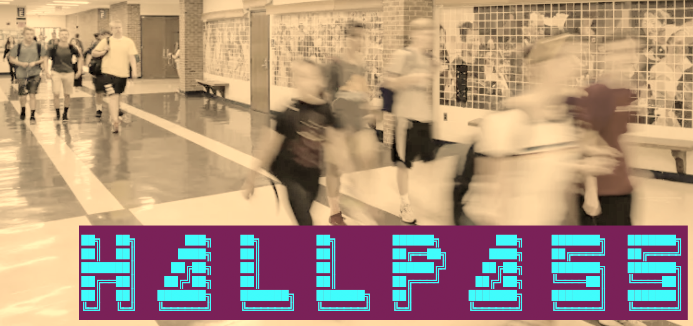
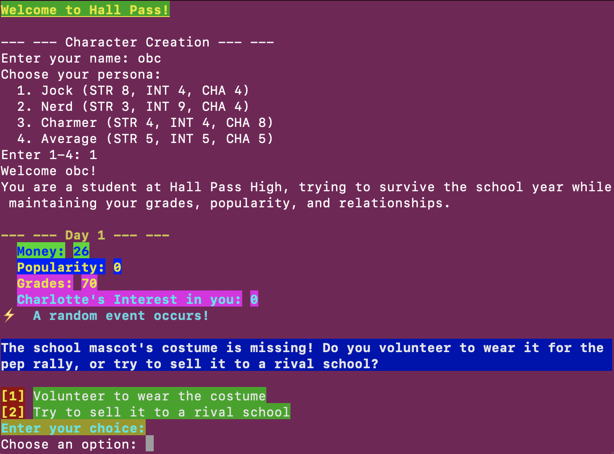

# Hall Pass

Welcome to **Hall Pass** – A hilarious, strategic, and unpredictable school-life text-based simulation game written in Rust!

Navigate the wild world of high school, where every hallway hides a new opportunity (or disaster), and every decision can make you a legend or a laughingstock.

---



Date: 11 June 2025

[Oliver Bonham-Carter](https://www.oliverbonhamcarter.com/)

Email: obonhamcarter at allegheny.edu

- [Hall Pass](#hall-pass)
  - [🎮 Introduction](#-introduction)
  - [🚀 Getting Started](#-getting-started)
    - [Prerequisites](#prerequisites)
    - [Setup](#setup)
  - [🕹️ How to Play](#️-how-to-play)
  - [🤝 Contributing](#-contributing)
  - [🛀🏻 License](#-license)
  - [🪐 A Work In Progress](#-a-work-in-progress)

## 🎮 Introduction

**Hall Pass** puts you in the sneakers of a student trying to survive and thrive through a day at school. Will you ace the pop quiz, pull off a daring milk heist, or challenge the principal to a showdown? You are trying to maintain your popularity, money, and grades, in addition to trying to impress the lovely Charlotte, the (potential) love of your life! Every event is random, every choice matters, and your stats (popularity, money, grades) are always on the line!



This game is a love letter to the classic text-based games of yore, infused with a modern twist of humor and strategy. Whether you're a seasoned gamer or new to the world of Rust, **Hall Pass** offers a unique experience that combines nostalgia with fresh gameplay.

This game is designed to be fun, engaging, and a little bit chaotic. You never know what will happen next, and that's part of the charm!

This game is packed with:

- Ironic and funny random events
- Strategic choices with unpredictable outcomes
- Dynamic stat tracking
- A retro text-based interface
- interactivity that keeps you on your toes
- A light-hearted take on high school life
- A chance to impress Charlotte, the love interest of your character
- A nostalgic nod to classic text-based games
- A unique blend of humor and strategy
- A game that is easy to pick up but hard to master
- A game that is fun to play with friends or solo

## 🚀 Getting Started

### Prerequisites

- [Rust](https://www.rust-lang.org/tools/install) (latest stable version recommended)
- A terminal (macOS, Linux, or Windows)

### Setup

1. **Clone the repository:**
   ```sh
   git clone git@github.com:developmentAC/hallpass.git
   cd hall_pass
   ```

2. **Build the project:**
   ```sh
   cargo build
   ```

3. **Run the game:**
   ```sh
   cargo run
   ```

## 🕹️ How to Play

- The game presents you with random school events.
- For each event, choose your response.
- Your stats (popularity, money, grades) will change based on your choices and a bit of luck.
- Try to finish the day with the highest stats possible!

## 🤝 Contributing

Contributions are welcome! If you have ideas for improvements or want to add more features, feel free to open an issue or submit a pull request.

To contribute:

1. Fork the repository
2. Create a new branch (`git checkout -b feature/your-feature`)
3. Make your changes
4. Commit and push (`git commit -am 'Add new feature' && git push origin feature/your-feature`)
5. Open a Pull Request

## 🛀🏻 License


## 🪐 A Work In Progress

Check back often to see the evolution of the project! **Hall Pass** is a work-in-progress. Updates will come periodically.

If you would like to contribute to this project, please do! For instance, if you see some low-hanging fruit or tasks that could add value to the project, I would love to have your insight.

Otherwise, please create an issue for bugs or errors. Since I am a teaching faculty member at Allegheny College, I may not have all the time necessary to quickly fix bugs. I welcome the Open Source Community to further the development of this project. Much thanks in advance.

If you appreciate this project, please consider clicking the project's Star button. :-)

---

**Have fun, and may your hall pass never expire!**
